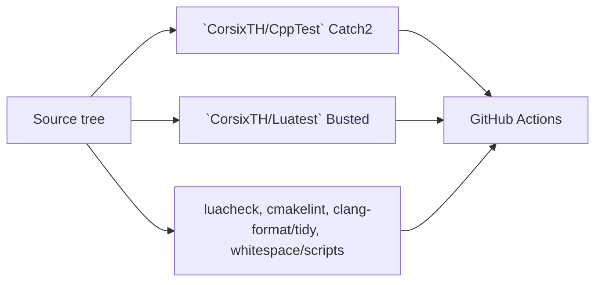
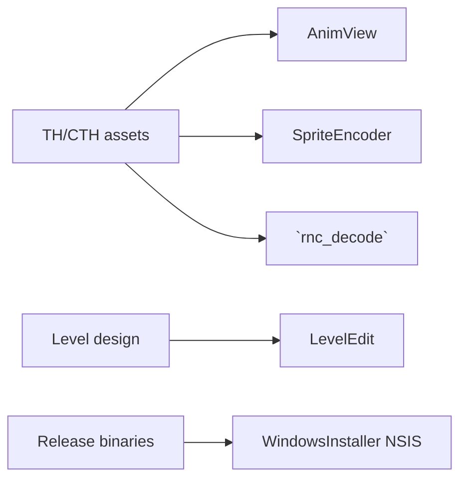

# Build, Test, and Tooling Architecture

## Build graph

```mermaid
flowchart TD
  CMakeTop[`CMakeLists.txt` (top-level)] --> Libs[`libs/`]
  CMakeTop --> Game[`CorsixTH/`]
  CMakeTop --> Anim[Optional `AnimView/`]
  CMakeTop --> Cli[Optional `tools/`]

  Game --> Src[`Src/` native runtime]
  Game --> Entry[`SrcUnshared/` entrypoint]
  Game --> LuaData[`Lua/` + data install targets]

  Game --> Deps[External deps\nSDL2 SDL2_mixer Lua Freetype PNG Zlib\nFFmpeg(optional) Curl(optional) RtMidi(optional)]
```

## Purpose of build components

- Top-level CMake: Feature toggles (`WITH_MOVIES`, `WITH_UPDATE_CHECK`, `WITH_MIDI_DEVICE`, tests/tools/animview).
- `CorsixTH/CMakeLists.txt`: Defines executable/lib targets, dependency wiring, install layout, and platform-specific packaging behavior.
- `CorsixTH/Src/CMakeLists.txt`: Declares native engine and Lua-bridge source set.
- `CorsixTH/SrcUnshared/CMakeLists.txt`: Adds process entrypoint source.
- `vcpkg.json` + presets: Reproducible dependency management across dev/release presets.

## Test and quality architecture



### Test component purposes

- `CppTest`: Validates native bridge and low-level behavior.
- `Luatest`: Validates Lua module behavior with test stubs/mocks.
- `scripts/*`: Enforces repository conventions (encoding, whitespace, class declaration checks).
- GitHub workflows: Execute multi-platform builds, tests, static checks, docs generation, and packaging artifacts.

## Auxiliary tooling architecture



- `AnimView`: Inspect visual/animation resources outside game runtime.
- `SpriteEncoder`: Encode/decode sprite assets for content pipeline work.
- `rnc_decode`: Decode RNC-compressed assets for debugging or extraction workflows.
- `LevelEdit`: Author level metadata with a GUI instead of manual text editing.
- `WindowsInstaller`: Produces end-user installer packages.

