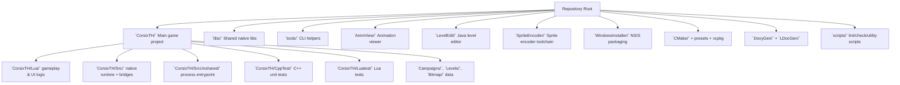
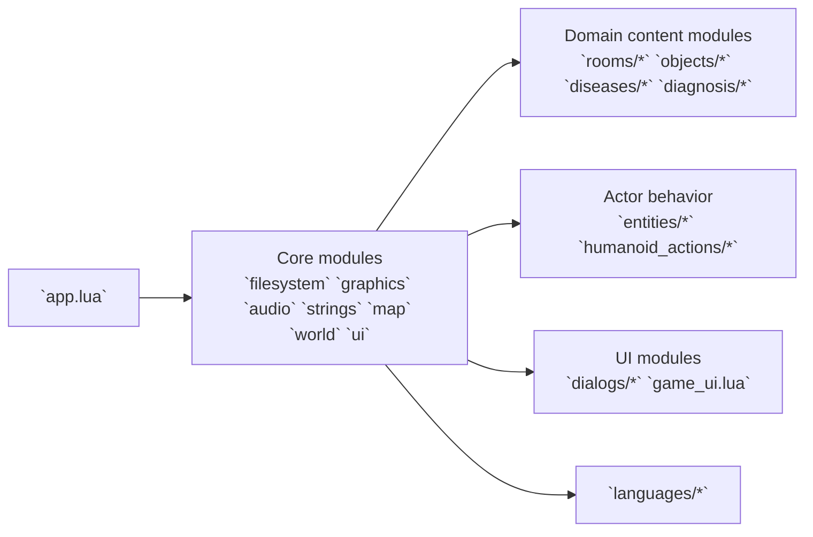

# Component Map

## Repository component diagram

## Component purposes

- `CorsixTH/Lua`: Primary domain logic (world simulation, entities, rooms, diseases, UI/dialogs, localization).
- `CorsixTH/Src`: Native support layer exposed to Lua (`TH`, `sdl`, `persist`, `rnc`) plus engine primitives.
- `CorsixTH/SrcUnshared`: OS-level executable entrypoint and Lua lifecycle management.
- `libs/rnc`: RNC decompression library used by game/runtime/tools.
- `libs/whereami`: Executable path discovery (used when searching local data dirs).
- `tools/rnc`: Standalone `rnc_decode` utility.
- `AnimView`: wxWidgets-based animation/resource viewer utility.
- `LevelEdit`: Java GUI for `.level` authoring.
- `SpriteEncoder`: Separate parser/encoder pipeline for sprite resource work.
- `WindowsInstaller`: NSIS scripts and language strings for packaging on Windows.

## Lua module topology

### Lua profile snapshot

- `objects/*`: `60` files
- `dialogs/*`: `60` files
- Root Lua modules: `36` files
- `diseases/*`: `34` files
- `humanoid_actions/*`: `32` files
- `languages/*`: `24` files

These counts reinforce the architectural intent: most gameplay behavior and content variation is data/module-driven in Lua.

