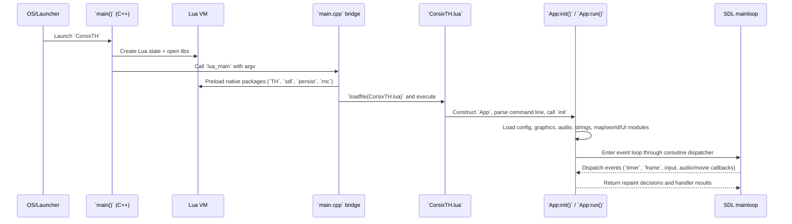
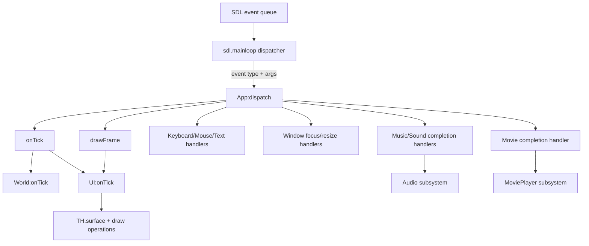

# Runtime Flow Architecture

## Startup and bootstrap sequence

## Component purposes in the startup path

- `main()` in `CorsixTH/SrcUnshared/main.cpp`: Creates Lua runtime, runs protected call to Lua entrypoint, and supports restart loop via `_RESTART` registry flag.
- `lua_main` in `CorsixTH/Src/main.cpp`: Validates Lua runtime compatibility, preloads native modules, locates `CorsixTH.lua`, and executes it.
- `CorsixTH.lua`: Runtime bootstrap contract between native executable and Lua game framework.
- `App:init()` in `CorsixTH/Lua/app.lua`: Initializes data paths, video/audio, resources, module graph, and initial UI state.
- `SDL.mainloop` in `CorsixTH/Src/sdl_core.cpp`: Converts SDL events into Lua dispatch calls.

## Runtime event architecture

## Why this design works

- Keeps gameplay logic in Lua where iteration is fast.
- Keeps rendering/map/pathfinding/audio primitives in C++ for performance and binary format handling.
- Uses a coroutine-aware event loop to preserve Lua stack traces and improve error recovery behavior.

