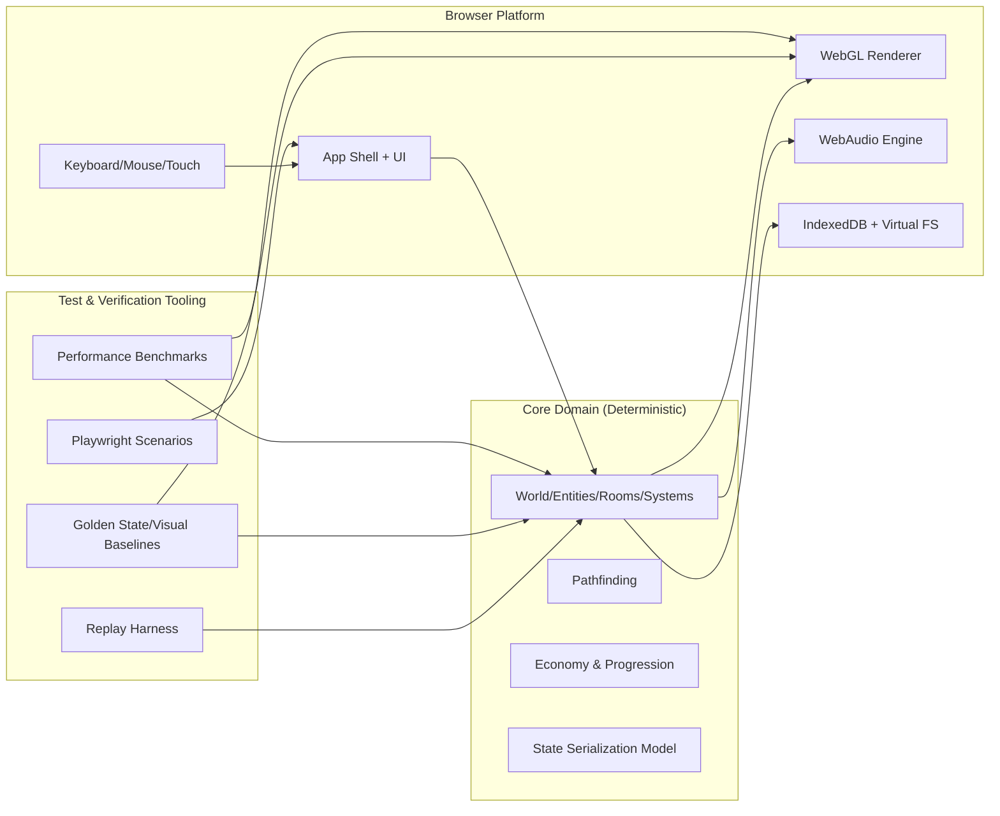

# TypeScript + WebGL + WebAudio Rewrite Plan (Working Document)

Status: Draft v1  
Owner: Rewrite team  
Last updated: 2026-02-11

## Locked toolchain baselines

- Node.js major: `23`
- pnpm major: `10`
- Playwright: `1.58.2` (or newer patch within `1.58.x`)

## Purpose

This is the execution document for a full browser-first rewrite of CorsixTH using TypeScript, WebGL, and WebAudio. It is intended to stay "live" through delivery, with explicit checkpoints, decision records, and next-step ownership so the rewrite can be completed from start to finish with controlled risk.

This plan is intentionally test-first and verification-heavy: every subsystem must have strong tests before migration and must pass parity checks during migration.

## Operating rules for this working document

1. Update this file at every checkpoint closeout.
2. Record all architecture and scope decisions in the decision log section.
3. Keep the "Next steps (active)" section current at all times.
4. Do not start a new phase until all exit criteria and quality gates pass.
5. If a gate fails, record the failure in the checkpoint log and add remediation steps before proceeding.

## Scope

In:
- Browser runtime rewrite of game client.
- New architecture in TypeScript with modular rendering/audio/simulation.
- Import and usage pipeline for legally acquired Theme Hospital data.
- Full test harness for determinism, gameplay parity, rendering, audio triggers, persistence, and performance.

Out (initial release):
- Multiplayer.
- AI hospitals beyond current practical behavior parity target.
- Feature-expansion work unrelated to parity and browser viability.

## North-star goals

1. Playable browser game with stable performance and reliable saves.
2. Deterministic core simulation with replay support.
3. Continuous parity measurement against current behavior on agreed scenarios.
4. CI that prevents regressions in logic, visuals, and performance.
5. Delivery model that allows safe incremental rollout.

## Guardrails (must hold for all phases)

1. Deterministic simulation core is isolated from browser APIs.
2. No direct DOM/WebGL/WebAudio imports in simulation packages.
3. Every migrated feature includes tests before and after migration.
4. Every PR must pass unit + integration + lint + typecheck.
5. Every milestone branch must pass replay and snapshot baselines.

## Canonical local asset fixture (current machine)

Detected Theme Hospital game-data path:
- `/Applications/Theme Hospital.app/Contents/Resources/game`

Required baseline contents for parity/import validation:
- directories: `DATA`, `LEVELS`, `QDATA`
- files: `HOSPITAL.CFG`, `HOSPITAL.EXE`

Preflight check command:
- `bash scripts/verify_theme_hospital_assets.sh`

Override path when needed:
- `THEME_HOSPITAL_ASSETS=\"/custom/path/to/game\" bash scripts/verify_theme_hospital_assets.sh`

## Target architecture



## Proposed repository structure (rewrite workspace)

```text
web/
  package.json
  pnpm-workspace.yaml
  tsconfig.base.json
  packages/
    core/                 # deterministic simulation only
    rules/                # disease/room/action rules and balancing
    renderer-webgl/       # map/sprite/effects/camera
    audio-webaudio/       # sfx/music/mixing
    assets/               # loaders/decoders/converters
    persistence/          # save schema/migrations/indexeddb adapters
    app/                  # shell, runtime orchestration, UI routing
    replay/               # deterministic event replay and assertions
    testkit/              # shared fixtures, generators, helpers
  apps/
    game/                 # browser app entry
    scenario-runner/      # headless simulation runner
  docs/
    parity-specs/
    milestone-reports/
```

## Tooling and standards

Runtime and build:
- TypeScript (strict mode), pnpm workspaces, Vite, WebGL2.

Tests and verification:
- Vitest for unit/integration.
- Playwright for browser E2E and screenshot tests.
- Pixelmatch (or equivalent) for visual diffs.
- fast-check for property-based tests.
- Custom replay harness with seeded RNG and deterministic clocks.

Quality gates:
- ESLint + TypeScript strict typecheck.
- Mandatory coverage thresholds for critical packages.
- CI gates for determinism, parity scenarios, and performance budgets.

## Definition of done (release)

1. All critical gameplay loops in parity target list pass.
2. Replay determinism is stable across CI runs and developer machines.
3. Save/load roundtrip and migration tests pass.
4. Visual and audio trigger baselines are green.
5. Performance budgets met on target browser/device matrix.
6. Release checklist and rollback plan tested once in staging.

## Phase plan with mandatory checkpoints

## Phase 0: Program setup and baselines

Objective:
- Establish repo, tooling, governance, and baseline measurements from current game.

Deliverables:
- Rewrite workspace scaffold.
- CI pipeline with required status checks.
- Baseline parity scenario list from current game.
- Initial replay format spec.
- Asset preflight check wired into parity/import test setup.

Required tests before moving on:
- Lint/typecheck/unit smoke passing in CI.
- Replay harness can run trivial deterministic scenario.
- Asset preflight script passes on the canonical fixture path.

Exit criteria:
- Team can run `dev`, `test`, `replay`, and `e2e` commands consistently.
- Baseline document for current behavior is checked in.

Checkpoint:
- CP-0 complete.

## Phase 1: Deterministic simulation kernel

Objective:
- Build world tick, scheduling, entity model, and random model with deterministic execution.

Deliverables:
- `packages/core` deterministic tick engine.
- Seeded RNG utility and simulation clock.
- Stable state hashing function for replay assertions.

Required tests:
- Unit tests for scheduler and RNG.
- Property tests for invariants (no invalid positions, bounded values, monotonic counters where expected).
- Determinism tests: same seed/input => identical tick-by-tick hash.

Exit criteria:
- 1000+ tick deterministic replay passes on CI.
- No browser APIs in core dependency graph.

Checkpoint:
- CP-1 complete.

## Phase 2: Map, occupancy, and pathfinding

Objective:
- Rebuild map model, occupancy, and navigation primitives.

Deliverables:
- Tile map representation and metadata model.
- Occupancy map and movement constraints.
- Pathfinding service with deterministic tie-breaking.

Required tests:
- Golden path cases with known expected routes.
- Property tests for connectivity and impassable tiles.
- Performance microbenchmarks for route solve times.

Exit criteria:
- Pathfinding correctness baseline agreed and green.
- Pathfinding perf within budget for target map sizes.

Checkpoint:
- CP-2 complete.

## Phase 3: Rendering pipeline (WebGL)

Objective:
- Build renderer for tilemap, sprites, depth ordering, camera, and zoom/scroll.

Deliverables:
- `packages/renderer-webgl` with deterministic scene build order.
- Texture atlas handling and sprite batching.
- Debug overlays for tile/entity info.

Required tests:
- Visual snapshot tests on fixed scenes and camera states.
- Pixel-diff thresholds documented and enforced.
- Frame-time profiling tests in scripted scenes.

Exit criteria:
- Stable snapshots across CI runners.
- 60 FPS target met in baseline scene on agreed desktop target.

Checkpoint:
- CP-3 complete.

## Phase 4: Input and app shell

Objective:
- Implement browser shell, user input routing, and game loop integration.

Deliverables:
- `packages/app` orchestration layer.
- Keyboard/mouse/touch input normalization.
- Pause/step/debug controls and telemetry panel.

Required tests:
- Input mapping tests (key/mouse/touch event normalization).
- E2E smoke flow: load scenario, interact, pause, resume.

Exit criteria:
- App shell can run scripted scenario from start to steady-state.
- Debug panel exposes tick, seed, and current state hash.

Checkpoint:
- CP-4 complete.

## Phase 5: Audio system (WebAudio)

Objective:
- Implement deterministic audio trigger layer and browser-compatible playback.

Deliverables:
- `packages/audio-webaudio` playback/mixer graph.
- Event-to-audio trigger mapping.
- Browser gesture-safe audio initialization flow.

Required tests:
- Trigger contract tests (event => expected sound call).
- Mute/volume/pause/resume tests.
- E2E checks for no autoplay policy violations.

Exit criteria:
- Audio behavior is reliable in target browsers.
- Trigger baseline suite is green.

Checkpoint:
- CP-5 complete.

## Phase 6: Persistence and migrations

Objective:
- Add save/load, schema versioning, and migration support.

Deliverables:
- Save schema definitions and versioned migration pipeline.
- IndexedDB adapter and export/import save support.
- Corruption handling and fallback behavior.

Required tests:
- Roundtrip save/load equality tests.
- Cross-version migration tests for all defined schema versions.
- Fault injection tests for corrupted or partial saves.

Exit criteria:
- Save reliability meets acceptance criteria.
- Backward migration policy documented.

Checkpoint:
- CP-6 complete.

## Phase 7: Gameplay systems migration (vertical slices)

Objective:
- Port gameplay systems in prioritized slices, each shipped with parity tests.

Slice order (recommended):
1. Core hospital loop (spawn, queue, diagnose, treat, discharge).
2. Staff lifecycle and room operations.
3. Economy/progression/events.
4. Secondary systems and polish features.

Required tests for each slice:
- Unit tests for each new rule/system.
- Replay parity tests against baseline scenarios.
- E2E player journey tests for that slice.

Exit criteria:
- Slice parity threshold achieved before next slice starts.
- No critical regression in previous slice test suites.

Checkpoint:
- CP-7.x complete for each slice.

## Phase 8: Asset import and legality-safe pipeline

Objective:
- Implement user-provided data import workflow and converters.

Deliverables:
- Browser import UI and validation.
- Data decode/transform pipeline.
- Clear user guidance for required original assets.

Required tests:
- Import success/failure matrix tests.
- Fixture tests for known data variants.
- E2E: first-time import to playable state.

Exit criteria:
- New user can import assets and play without manual file editing.
- Import diagnostics are actionable.

Checkpoint:
- CP-8 complete.

## Phase 9: Hardening and performance

Objective:
- Close quality gaps, optimize runtime, and complete compatibility validation.

Deliverables:
- Performance tuning pass.
- Browser compatibility report.
- Final bug triage burn-down.

Required tests:
- Stress replay scenarios.
- Long-session memory leak checks.
- Performance threshold CI jobs.

Exit criteria:
- Performance and reliability budgets achieved.
- Release readiness checklist complete.

Checkpoint:
- CP-9 complete.

## Phase 10: Release and post-release safeguards

Objective:
- Ship safely with rollback and diagnostics.

Deliverables:
- Staged rollout plan.
- Crash/error telemetry and dashboards.
- Rollback and hotfix runbooks.

Required tests:
- Dry-run release in staging.
- Rollback simulation validated once.

Exit criteria:
- Production launch checklist fully signed.
- On-call ownership and triage process active.

Checkpoint:
- CP-10 complete.

## Test strategy (required depth by layer)

Simulation:
- Determinism tests.
- Invariant/property tests.
- Golden scenario state tests.

Renderer:
- Snapshot tests for map/entity/UI layers.
- Pixel-diff regression checks.
- Render-order correctness tests.

Audio:
- Trigger mapping tests.
- State transition tests (pause/resume/mute/focus loss).

Persistence:
- Roundtrip equality tests.
- Migration and corruption tests.

Application:
- E2E scripted flows with Playwright.
- Import/setup/play/save/reload/continue user journeys.

Performance:
- Tick throughput benchmarks.
- Frame-time budgets for key scenes.
- Memory growth checks for long sessions.

## Required CI pipeline

On every PR:
1. Lint (required gate).
2. Typecheck (required gate).
3. Unit tests (required gate).
4. Determinism replay subset (required gate).
5. Playwright E2E smoke subset (required gate).

Nightly:
1. Full replay parity suite.
2. Full visual regression suite.
3. Performance benchmark suite.
4. Browser matrix run.

Release candidate:
1. Full pipeline.
2. Staging deployment.
3. Manual acceptance checklist.

## Mandatory parity and verification protocol

For every migrated subsystem:
1. Document legacy behavior and edge cases first.
2. Add tests that lock those behaviors.
3. Implement rewritten subsystem.
4. Run parity scenarios and compare outputs.
5. Record result in checkpoint log with pass/fail and follow-up actions.

No subsystem is considered "done" without both:
- test completion, and
- parity verification evidence.

## Decision log (append-only)

Use this format for every architecture/product decision.

| ID | Date | Decision | Alternatives considered | Why chosen | Impacted packages | Follow-up actions | Owner |
|---|---|---|---|---|---|---|---|
| D-001 | 2026-02-11 | Adopt TypeScript + WebGL + WebAudio architecture | Rust+WASM, C++ Emscripten, Godot | Best browser delivery speed and testability | core, renderer-webgl, audio-webaudio, app | Define package interfaces | TBD |
| D-002 | 2026-02-11 | Scaffold rewrite monorepo under `web/` with package boundaries from this plan | Single-package app, incremental mixed C++/TS tree | Preserves clean deterministic core boundaries and keeps migration reviewable per package | core, rules, renderer-webgl, audio-webaudio, assets, persistence, app, replay, testkit, apps/game, apps/scenario-runner | Fill subsystem implementations phase-by-phase behind locked tests | Rewrite team |
| D-003 | 2026-02-11 | Define deterministic replay fixture schema `replay.v0` with locked step hashes | Ad-hoc test scripts, non-versioned fixture format | Versioned replay artifacts provide stable parity evidence and future migration path | core, replay, testkit, app | Extend fixture set for each migrated subsystem and parity scenario | Rewrite team |
| D-004 | 2026-02-11 | Enforce Phase 0 gate contract through `phase0:check` script and dedicated workflow | Manual local checks only, single combined CI job without explicit gates | Makes lint/typecheck/unit/replay/e2e/assets checks explicit and reproducible | web scripts, CI workflow, replay, app | Wire branch protection required checks in repository settings | Rewrite team |
| D-005 | 2026-02-11 | Add local tool-resolution wrapper (`./node_modules` first, `../node_modules` fallback) for gate commands | Block local execution until full `web` install is possible | Keeps Phase 0 validation executable despite offline npm DNS limitations while preserving standard CI install path | web command scripts, local tooling | Add standard `web/pnpm-lock.yaml` from networked environment for fully isolated workspace installs | Rewrite team |

## Checkpoint log (append-only)

Use this format at each checkpoint close.

| Checkpoint | Date | Status | Gates passed | Gates failed | Evidence links | Risks opened | Risks closed | Owner |
|---|---|---|---|---|---|---|---|---|
| CP-0 | 2026-02-11 | Complete | lint, typecheck, unit, replay-smoke, e2e-smoke, asset-preflight | - | `web/docs/milestone-reports/2026-02-11-cp0-validation.md`; `web/docs/parity-specs/phase-0-initial-parity-scenario-catalog.md`; `.github/workflows/web-rewrite-phase0.yml` | R-004 | - | Rewrite team |

## Risk register

| ID | Risk | Probability | Impact | Mitigation | Trigger | Owner | Status |
|---|---|---|---|---|---|---|---|
| R-001 | Non-deterministic behavior from hidden browser timing dependencies | Medium | High | Strict core isolation + deterministic replay harness | Divergent state hashes with same seed/input | TBD | Open |
| R-002 | Visual parity instability across GPU/browser combos | Medium | Medium | Snapshot tolerance policy + browser matrix CI | Snapshot flake rate exceeds threshold | TBD | Open |
| R-003 | Scope creep from non-parity feature requests | High | Medium | Freeze parity backlog and enforce change control | New feature work enters critical path | TBD | Open |
| R-004 | Local workspace bootstrap can fail in restricted/offline environments due npm registry DNS | Medium | Medium | Keep CI network install path and provide local fallback command wiring to preinstalled tools | `pnpm install --dir web` fails with registry lookup errors | Rewrite team | Open |

## Active next steps (must always be current)

Current phase target:
- Phase 0: Program setup and baselines (complete on 2026-02-11).

Next actions:
1. Lock repository branch protection to require `Web Rewrite Phase 0` workflow gates.
2. Generate and commit `web/pnpm-lock.yaml` from a networked environment for fully standard workspace installs.
3. Prepare Phase 1 test-first plan: scheduler/RNG/property tests and `1000+` tick deterministic replay target.
4. Finalize supported browser/device matrix and measurable performance budgets before CP-1 execution.
5. Hold Phase 0 checkpoint review and confirm explicit Phase 1 start authorization.

Definition of immediate success:
- CP-0 closed with all gates green and evidence links captured.

## Team cadence and accountability

Daily:
- Update "Active next steps" and open risks.

Weekly:
- Checkpoint review and decision log review.
- Confirm phase gate status and remediation plan for failures.

Milestone close:
- Record checkpoint entry with evidence links.
- Confirm next phase owner and start date.

## Appendix A: Suggested command contract (rewrite workspace)

```bash
cd web
pnpm install
pnpm lint
pnpm typecheck
pnpm test
pnpm replay
pnpm test:replay
pnpm test:e2e
pnpm test:assets
pnpm test:visual
pnpm bench
pnpm dev
pnpm phase0:check
```

## Appendix B: Acceptance checklist template for each subsystem

| Item | Result | Evidence | Notes |
|---|---|---|---|
| Legacy behavior documented |  |  |  |
| Tests added before rewrite |  |  |  |
| Rewrite implemented |  |  |  |
| Unit tests pass |  |  |  |
| Integration tests pass |  |  |  |
| Replay parity pass |  |  |  |
| Visual/audio checks pass (if applicable) |  |  |  |
| Performance budget pass |  |  |  |
| Decision/checkpoint logs updated |  |  |  |
